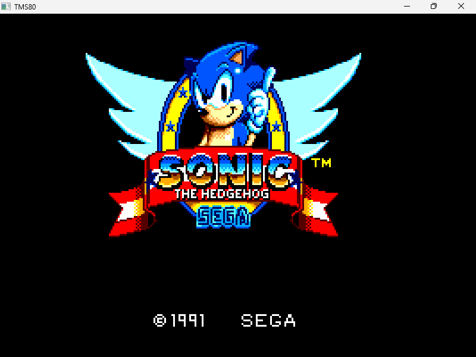
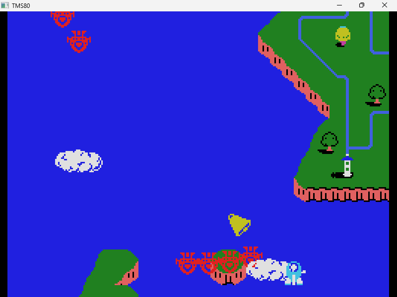
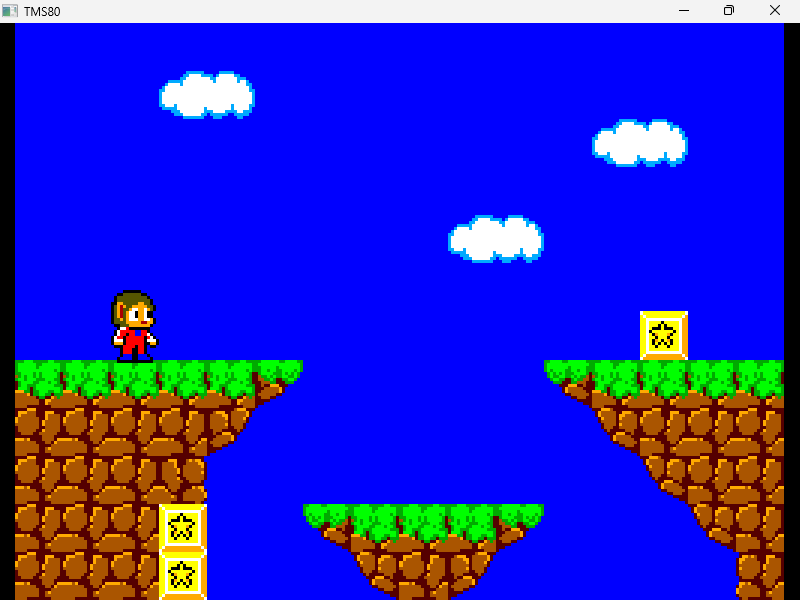
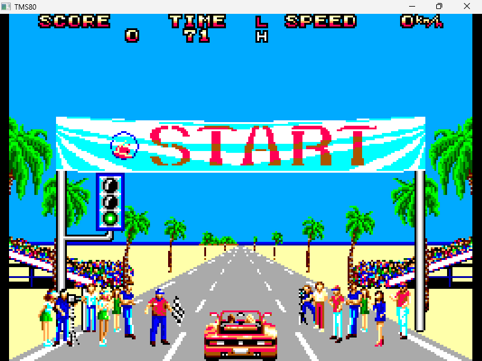
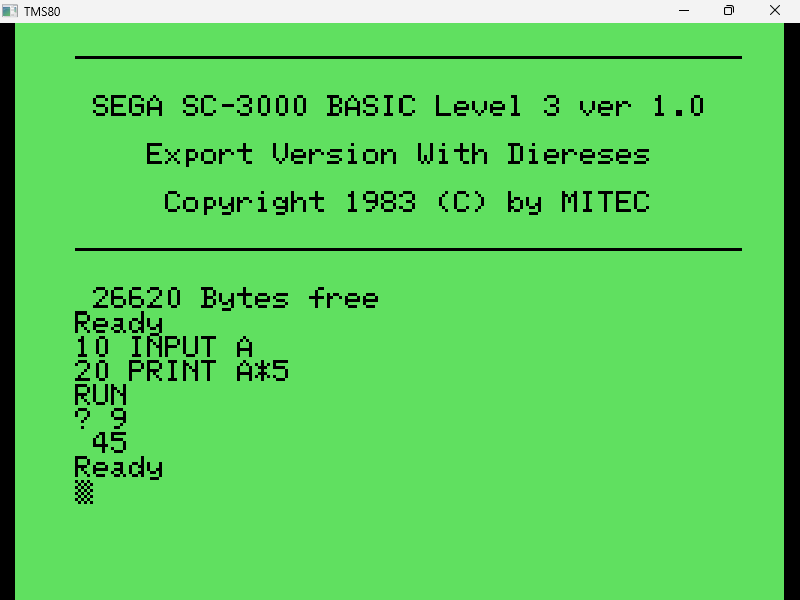
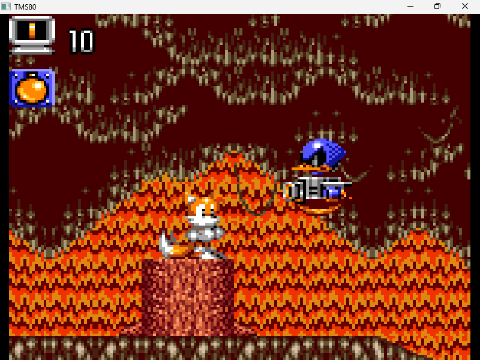

# TMS80

## General Information

TMS80 is a minimal emulator written in C that emulates some systems that have a Z80 and a TMS9918. 
The supported systems are:

- [X] SG-1000
- [X] SC-3000
- [X] Sega Master System
- [X] Sega Game Gear

## How to use

To run the emulator just execute:
```tms80.exe <rom path>```
Alternatively, you can drag and drop the ROM file to the executable file.

The emulator also provides the possibility to use a bios (it is necessary to emulate correctly only few games of the sega master system that rely on bios initialization):

| COMMAND LINE | EFFECT |
|-------------|----------|
| ```-b```/```--bios``` | specify the bios to use |
| ```-r```/```--rom``` | specify the rom to use |

If the rom name contains ```(Europe)```/```(E)```/```(Brazil)```/```[E]``` in the filename, TMS80 will emulate a PAL console, otherwise an NTSC one.

## Missing features

- [ ] 224/240 lines mode of the Master System's 2 VDP/
- [ ] Codemaster's mapper.
- [ ] Multicolor mode of TMS9918 (since no licensed game uses it).

## Controls

| PC | CONSOLE |
|----|---------|
| ARROW KEY | DPAD |
| Z | BUTTON 1 |
| X | BUTTON 2 |
| F1 | PAUSE BUTTON (EXCEPT FOR GAME GEAR) |
| WHOLE KEYBOARD | SC-3000 KEYBOARD |
| RETURN | START BUTTON (GAME GEAR ONLY) |
| F2 | SWITCH TO PADDLE CONTROLLER (use mouse X axis position to move and left click to press the button) |

If you press F3, a waveform visualizer will appear.

## Demo

You can find a minimal demo [here](https://yughias.github.io/pages/tms80/emulator.html)

## Screenshots

|  |  |
| -- | -- |
|  |  |
|  |  |
